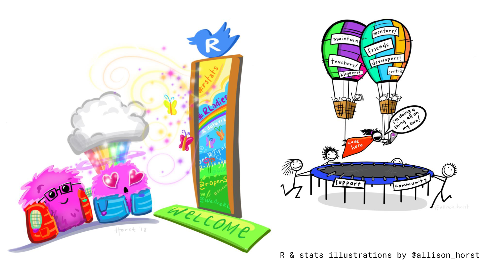

layout: true

<style>
.onehundredtwenty {
  font-size: 120%;
   }

<style>
.ninety {
  font-size: 90%;
   }

.eightyfive {
  font-size: 85%;
   }
   
.eighty {
  font-size: 80%;
   }
   
.seventyfive {
  font-size: 75%;
   }
   
.seventy {
  font-size: 70%;
   }
   
.fifty {
  font-size: 50%;
   }
   
.forty {
  font-size: 40%;
   }
</style>

```{r meta, echo=FALSE, warning = F, message=F}
library(metathis)
meta() %>%
  meta_general(
    description = "Welcome to the Tidyverse",
    generator = "xaringan and remark.js"
  ) %>%
  meta_name("github-repo" = "rahulvenugopal/xxx") %>%
  meta_social(
    title = "Intro to Tidyverse",
    url = "https://rahulvenugopal.github.io/haveyoumetrahul/",
    og_type = "website",
    og_author = "Rahul Venugopal",
    twitter_card_type = "summary_large_image",
    twitter_creator = "@rhlvenugopal"
  )
```

```{r xaringanExtra, echo = FALSE}
xaringanExtra::use_progress_bar(color = "#5d9a00",
                                location = "top", 
                                height = "5px")
```

```{r xaringan-logo, echo=FALSE}
xaringanExtra::use_logo(
  image_url = "https://raw.githubusercontent.com/rstudio/hex-stickers/main/PNG/xaringan.png",
  width = "50px",
  height = "50px",
  link_url = "https://rahulvenugopal.github.io/haveyoumetrahul/",
  position = xaringanExtra::css_position(top = "1em", right = "1em")
)
```

```{r setup, include=FALSE}

workshop_day <- format(as.Date("2023-07-20"), format="%B %d %Y")
pacman::p_load(tidyverse, fontawesome, tidyverse, knitr)

options(
    htmltools.dir.version = FALSE,
    knitr.table.format = "html",
    knitr.kable.NA = ""
)
knitr::opts_chunk$set(
    warning = FALSE,
    message = FALSE,
    fig.path = "images/",
    fig.width = 7.252,
    fig.height = 4,
    comment = "#>",
    fig.retina = 3 # Better figure resolution
)
# Enables the ability to show all slides in a tile overview by pressing "o"
xaringanExtra::use_tile_view()
xaringanExtra::use_panelset()
xaringanExtra::use_clipboard()

xaringanExtra::use_extra_styles(
  hover_code_line = TRUE,
  mute_unhighlighted_code = FALSE
)

knitr::opts_chunk$set(warning = F, message = F) # Whether to display errors
```

---
name: title-slide
class: primary


#.fancy[`r rmarkdown::metadata$title`] 

###.fancy[`r rmarkdown::metadata$subtitle`]


<br>

Rahul Venugopal

[`r fa(name = "twitter", fill = "black")`](http://twitter.com/rhlvenugopal)<br>
[`r fa(name = "github", fill = "black")` ](http://github.com/rahulvenugopal)<br>
[`r fa(name = "link", fill = "black")` ](https://rahulvenugopal.github.io/haveyoumetrahul/)

---

### Your friendly neighborhood R Instructor

.leftcol40[


]

.rightcol60[
+ Ph.D scholar at Centre for Consciousness Studies, NIMHANS, India

+ Cracking the brain's code with an engineer's wand

+ I love to teach and mentor
]

---

### It's not unusual to struggle at first but it gets better!

```{r, echo = F, out.width="80%", fig.align = 'center'}
knitr::include_graphics("images/r_first_then_new.png")
```


<!-- {width=50%} -->

.fifty[Illustration adapted from [Allison Horst](https://twitter.com/allison_horst)]

--

+ My experience is that this stuff isn't super easy... but it gets better!

---

```{r, echo = F, out.width="80%", fig.align = 'center'}

```

---

```{r, echo = F, out.width="80%", fig.align = 'center'}

```
---

## R Packages

Packages are at the heart of R: 

* R packages are basically a collection of functions that you load into your working environment.

* They contain code that other R users have prepared for the community.

--

* It's good to know your packages, they can really make your life easier.

* I suggest keeping track of package developments either on Twitter via #rstats


---

## R Packages

You can install packages in R like this using the `install.packages` function:

```{r, eval = F}
install.packages("janitor")
```

However, installing is not enough. You also need to load the package via `library`.

```{r}
library(janitor)
```

Think of `install.packages` as buying a set of tools (for free!) and `library` as pulling out the tools each time you want to work with them.

---
<center>

</center>

---

## What is the `tidyverse`?

The tidyverse describes itself:

> The tidyverse is an opinionated **collection of R packages** designed for data science. All packages share an underlying design philosophy, grammar, and data structures.


<center>

</center>

---

## Core principle: tidy data

<center>

</center>

.fifty[Artist: [Allison Horst](https://github.com/allisonhorst)]
---

## Core principle: tidy data

Tidy data has two decisive advantages:

* Consistently prepared data is easier to read, process, load and save.

* Many procedures (or the associated functions) in R require this type of data.

<center>

</center>

.fifty[Artist: [Allison Horst](https://github.com/allisonhorst)]
---

## Installing and loading the tidyverse

First we install the packages of the tidyverse like this:

```{r, eval = F}
install.packages("tidyverse")
```

Then we load them:

```{r}
library(tidyverse)
```

---

## A new dataset appears..

We are going to work with a new data from here on out

Meet the Palmer penguins! Data were collected and made available by [Dr. Kristen Gorman](https://www.uaf.edu/cfos/people/faculty/detail/kristen-gorman.php) and the [Palmer Station, Antarctica LTER](https://pal.lternet.edu/)


---
<center>

</center>

---
<center>

</center>

.fifty[Artist: [Allison Horst](https://github.com/allisonhorst)]
---

## Palmer Penguins

We could install the R package `palmerpenguins` and then access the data

We can directly load a .csv file (comma-separated values) into R from the internet


```{r}
penguins_raw <- read_csv("https://raw.githubusercontent.com/allisonhorst/palmerpenguins/master/inst/extdata/penguins_raw.csv")

```

---


.leftcol75[

## Cleaning with `janitor`

]

.rightcol25[


```{r, echo = F, out.width=100, out.height=120, fig.align='right'}
knitr::include_graphics("https://github.com/sfirke/janitor/raw/main/man/figures/logo_small.png")
```

]

Provides some convenient functions for basic cleaning of the data

`clean_names`, `remove_constant` are some of them

---

.leftcol75[

## `tidyr`

]

.rightcol25[


```{r, echo = F, out.width=100, out.height=120, fig.align='right'}
knitr::include_graphics("https://tidyr.tidyverse.org/logo.png")
```

]

We can use a `tidyr` function called `separate()` to turn this into two variables.

Two arguments are important for that:

+ `sep`: specifies by which character the value should be split
+ `into`: a vector which specifies the resulting new variable names


---

class: center, middle

## `select()`

helps you select columns


---

class: center, middle

## `filter()`

helps you filter rows


---

class: center, middle

## `mutate()`

helps you create variables

---

class: center, middle

## `rename()`

helps you rename variables

---

class: center, middle

## `arrange()`

orders your dataset

---

class: center, middle

## `group_by()` and `summarize()`

when you want to aggregate your data (by groups)


---
# Time for a break

<center>


</center>